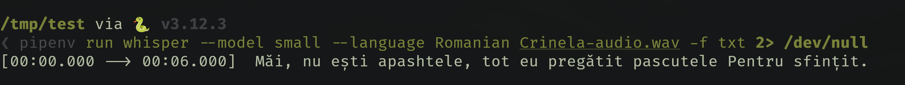
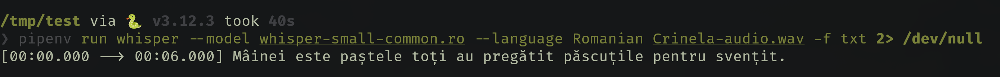
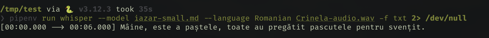
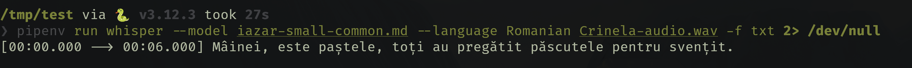

---
language:
- ro
license: apache-2.0
base_model: openai/whisper-small
tags:
- generated_from_trainer
datasets:
- Yehoward/iazar-date
- mozilla-foundation/common_voice_11_0
metrics:
- wer
model-index:
- name: Whisper Small Ro - Iazar
  results:
  - task:
      name: Automatic Speech Recognition
      type: automatic-speech-recognition
    dataset:
      name: Date audio colectate în cadrul proiectului TekWil
      type: Yehoward/iazar-date
      args: 'split: test'
    metrics:
    - name: Wer
      type: wer
      value: 46.265060240963855
---

<!-- This model card has been generated automatically according to the information the Trainer had access to. You
should probably proofread and complete it, then remove this comment. -->

# Whisper Small Ro - Iazar

O adjustare a modelului [openai/whisper-small](https://huggingface.co/openai/whisper-small) pe Date audio colectate în cadrul proiectului TekWill.
Obține următoarele rezultate pe setul de evaluare:
- Pierdere: 0,8207
- Wer: 46.2651

## Descriere

Este un model intenționat pentru transcrierea graiului Moldovenesc în text.

## Datele

Pentru antrenarea modelului s-au folosit atît date de la [Common Voice](https://huggingface.co/datasets/mozilla-foundation/common_voice_11_0), cît și [date colectate în cadrul proiectului](https://github.com/Yehoward/iazar-datacollector).

## Performanță

Am făcut niște testări pe mai multe modele, ca să observăm dacă există un oarecare progres.

Transcriere de către modelul preantrenat de la Whisper.

Transcriere de către modelul antrenat numai cu date de la Common Voice.

Transcriere de către modelul antrenat numai cu datele colectate în cadrul proiectului.

Transcrierea de către modelul antrenat atît cu date de la Common Voice, cît și cu date colectate în cadrul proiectului.

## Procedura de antrenament

### Codul de antrenare 

Am folosit google colab pentru antrenarea modelului.

mai multe detalii -> https://github.com/Yehoward/Iazar?tab=readme-ov-file#code_de_antrenare_iazaripynb

### Hiperparametri de antrenament

Următorii hiperparametri au fost utilizați în timpul antrenamentului:
- learning_rate: 1e-05
- train_batch_size: 16
- eval_batch_size: 8
- seed: 42
- optimizer: Adam with betas=(0.9,0.999) and epsilon=1e-08
- lr_scheduler_type: linear
- lr_scheduler_warmup_steps: 50
- training_steps: 200
- mixed_precision_training: Native AMP

### Rezultate antrenament

| Pierdere la antrenament | Epocă | Pasul | Pierdere de validare | Rata de erori a cuvintelor |
|:-------------:|:-------:|:----:|:---------------:|:-------:|
| 0.0005        | 66.6667 | 200  | 0.8207          | 46.2651 |

### Versiuni cadre

- Transformers 4.40.1
- Pytorch 2.2.1+cu121
- Datasets 2.19.0
- Tokenizers 0.19.1